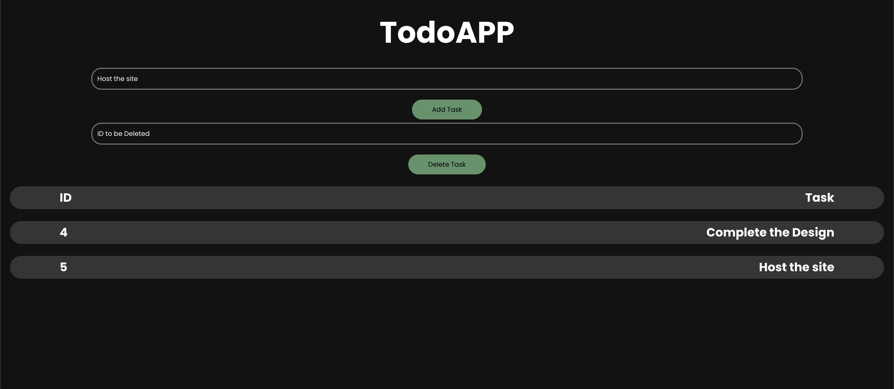

<h1>Todo-MERN</h1>

This simple Todo App uses MongoDB for backend and connects with ExpressJS. It uses ReactJS for frontend.
<h2>Technologies Used</h2>

<ul>
<li>CSS</li>
</ul><ul>
<li>React</li>
</ul><ul>
<li>NodeJS</li>
</ul><ul>
<li>MongoDB</li>
</ul><h2>Features</h2>

<ul>
<li>Clean UI</li>
</ul><ul>
<li>Mobile Responsive</li>
</ul><h2>Screenshots</h2>

<h2>Setup</h2>

Dependencies Required

<ul>
<li>ReactJS</li>
<li>ExpressJS</li>
<li>Cors</li>
</ul><h5>Steps</h5>

- Clone the Repo :
  `git clone https://github.com/TartejBrothers/TodoApp-MongoDB.git`
- Change Directory :
  `cd TodoAPP-MongodDB`

- Install npm packages :
  `cd Todo-API`
  `npm i`

- Change Directory :
  `cd ..`
  `cd website`
  `npm i`

</ul><h2>Improvements</h2>

<ul>
<li>Add update task</li>
</ul><ul>
<li>Add check for completed tasks</li>
</ul><h2>Contact</h2>

